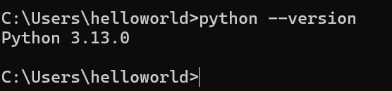
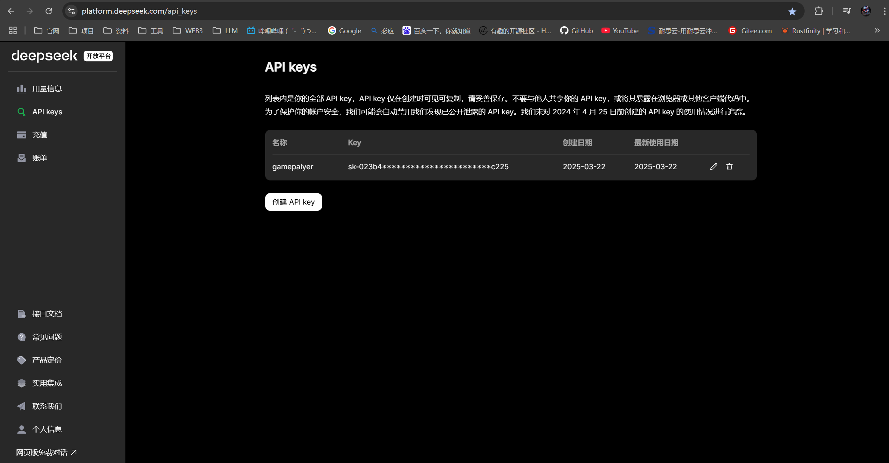
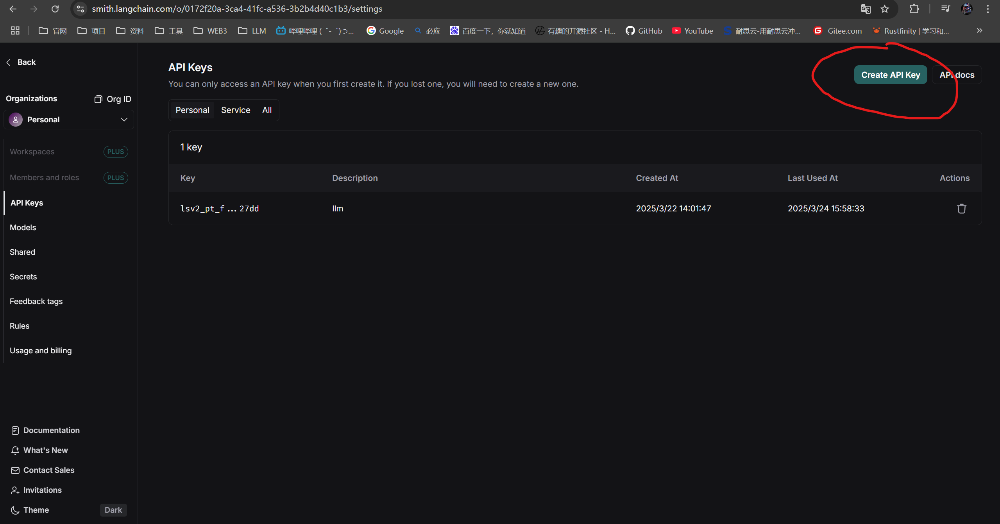
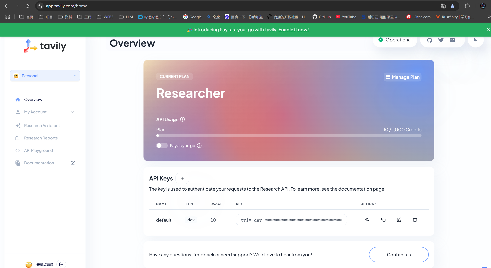

# My_LangChain_Study_Log
这是我的LangChain的学习记录

### 准备工作
1、安装好python



2、申请大模型的api-key

地址：[https://platform.deepseek.com/api_keys](https://platform.deepseek.com/api_keys)



3、申请Langsmith的api-key

地址：[https://smith.langchain.com/o/0172f20a-3ca4-41fc-a536-3b2b4d40c1b3/settings](https://smith.langchain.com/o/0172f20a-3ca4-41fc-a536-3b2b4d40c1b3/settings)



4、申请TAVILY的api-key

地址：[https://app.tavily.com/home](https://app.tavily.com/home)



5、要下载的包

```
pip install langgraph

pip install langchain

pip install langserve

pip install langchain_openai

pip install langchain_core

pip install langchain_community

pip install langchain_chroma

pip install langchain_text_splitters

pip install pydantic

pip install langchain_experimental
```

### LangChain的实例
* [LangChain的简单使用](/src/demo1.py)
* [LangServe的使用](/src/demo2.py)
* [LangChain聊天机器人](/src/demo3.py)
* [LangChain的RAG简单实现](/src/demo4.py)
* [使用langgraph实现Agent](/src/demo5.py)
* [LangChain使用RAG实现根据我们提供的内容回答问题](/src/demo6.py)
* [LangChain使用链实现对mysql的问题提问，并返回值](/src/demo7.py)
* [LangChain使用代理实现对mysql的问题提问，并返回值](/src/demo8.py)
* [LangChain内容提取](/src/demo9.py)
* [LangChain自动生成数据](/src/demo10.py)
* [LangChain实现文本分类](/src/demo11.py)
* [LangChain文本自动摘要-Stuff方式(填充)](/src/demo12-1.py)
* [LangChain文本自动摘要-Map-reduce方式(映射-归约)](/src/demo12-2.py)
* [LangChain文本自动摘要-Refine方式(细化)](/src/demo12-3.py)
