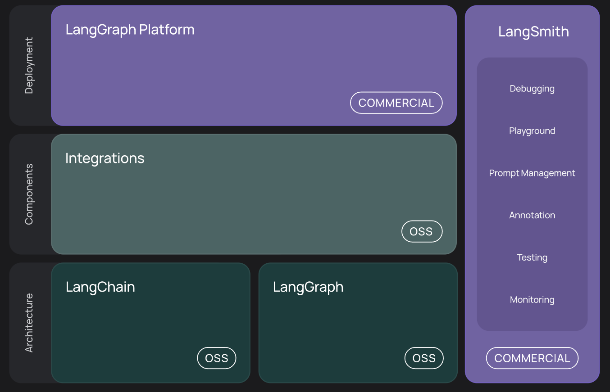
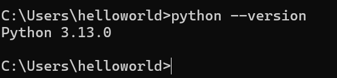
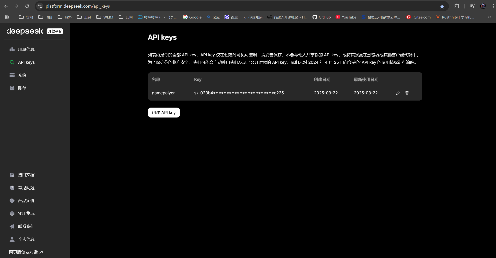
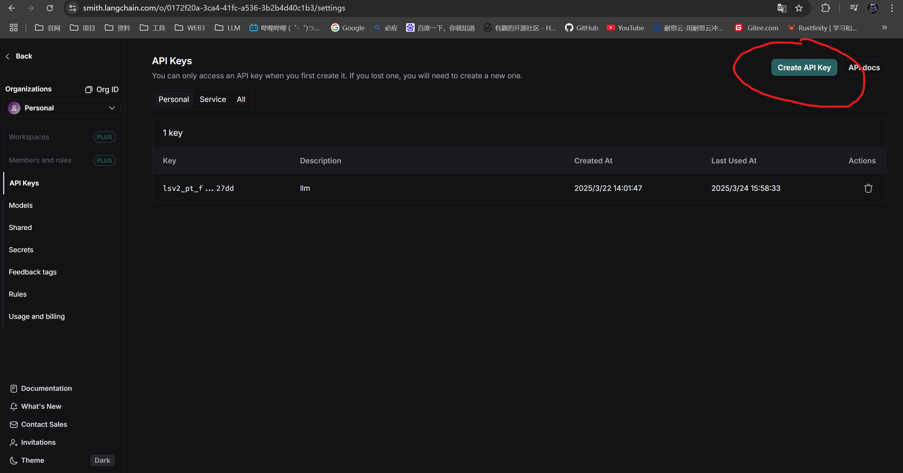
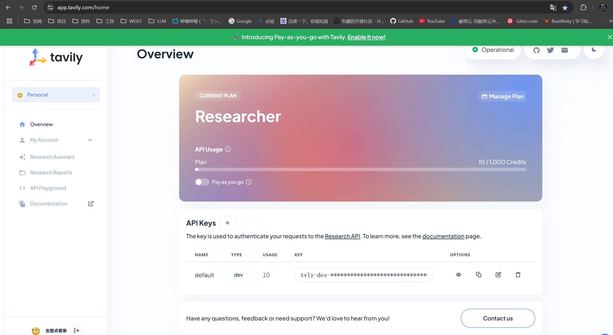

# My_LangChain_Study_Log
这是我的LangChain的学习记录

### LangChain的实例
* [LangChain的简单使用](/src/demo1.py)
* [LangServe的使用](/src/demo2.py)
* [LangChain聊天机器人](/src/demo3.py)
* [LangChain的RAG简单实现](/src/demo4.py)
* [使用langgraph实现Agent](/src/demo5.py)
* [LangChain使用RAG实现根据我们提供的内容回答问题](/src/demo6.py)
* [LangChain使用链实现对mysql的问题提问，并返回值](/src/demo7.py)
* [LangChain使用代理实现对mysql的问题提问，并返回值](/src/demo8.py)
* [LangChain内容提取](/src/demo9.py)
* [LangChain自动生成数据](/src/demo10.py)
* [LangChain实现文本分类](/src/demo11.py)
* [LangChain文本自动摘要-Stuff方式(填充)](/src/demo12-1.py)
* [LangChain文本自动摘要-Map-reduce方式(映射-归约)](/src/demo12-2.py)
* [LangChain文本自动摘要-Refine方式(细化)](/src/demo12-3.py)

### LangChain

#### LangChain的定义

LangChain是一个开源的开发框架，在帮助开发者快速构建基于大预言模型(LLM)的应用程序。它通过
模块化设计简化了与大模型交互的复杂性，支持灵活集成外部工具和数据源，使开发者能够高效实现复杂的AI
应用逻辑。



具体而言，该框架包括以下开源库：
- langchain-core: 基本抽象和LangChain表达语言。
- langchain-community: 第三方集成。 合作伙伴包(例如 langchain-openai、langchain-anthropic等)：一些集成已进一步拆分仅依赖于langchain-core 的轻量级包
- langchain: 构成应用程序认知框架的链、代理和检索策略。
- langgraph: 通过将步骤建模为图中的边缘和节点，使用LLMs构建稳健且有状态的多参与者应用程序。
- langserve: 将LangChain链部署为REST API。
- LangSmith: 一个开发平台，可让您调试、测试、评估和监控LLM应用程序。

#### 核心功能与作用

##### 模型集成(Models)
- 作用：统一接口对接多种大模型(如OpenAI GPT、Anthropic、Hugging Face等)，避免厂商锁定。
- 示例：通过ChatOpenAI或ChatAnthropic类快速切换不同模型，实现对话、文本生成等任务。

##### 模块化组件(Components)
- 提升模板（Prompts）：标准化提示词管理，支持变量注入和动态生成（如Few-shot Learning）。
- 文档加载器（Document Loaders）：支持PDF、网页、数据库等数据源的加载与预处理。
- 文本分割器（Text Splitters）：将长文本切分以适应模型输入限制。
- 向量存储（Vector Stores）：集成FAISS、Chroma等工具，实现文本向量化与相似性检索。

##### 链式调用(Chains)
- 作用：将多个步骤组合可复用的流程，处理复杂任务。
- 典型链：RetrievalQA链（检索+生成）、SequentialChain（顺序执行多个模型调用）。
- 场景：构建问答系统时，先检索知识库，再生成回答。

##### 记忆机制(Memory)
- 作用：维护对话历史或上下文状态，支持多轮交互。
- 实现方式：通过ConversationBufferMemory或ConversationSummaryMemory存储和管理历史消息。

##### 代理与工具(Agents & Tools)
- 代理（Agents）：让LLM动态选择调用工具，实现智能决策(如“使用搜索API查天气，再用计算器转换单位”)。
- 工具（Tools）：预置搜索引擎、Python REPL、API调用等工具，支持自定义扩展。

##### 数据增强(Retrieval-Augmented Generation, RAG)
- 作用：将外部数据（如问答、数据库）与LLM结合，提升生成内容的准确性和相关性。
- 流程：加载数据->向量化->检索相关片段->注入提示词->生成最终回答。

### 典型应用场景
- 智能回答系统：结合RAG处理领域知识库（如医疗、法律）。
- 对话机器人：支持多轮对话，个性化记忆（如客服助手）。
- 文档分析：自动总结长文本、提取关键信息。
- 自动化流程：通过代理调用工具执行代码、发送邮件等操作。
- 代码生成：根据需求描述生成并验证代码片段。

### LangChain的优点
- 模块化设计：按需组合组件，避免重复造轮子。
- 灵活性：兼容多种模型、数据源和工具，适应不同业务需求。
- 扩展性：支持自定义工具、链式流程和记忆逻辑。
- 开发效率“抽象底层细节，让开发者聚焦业务逻辑。

### LangChain的总结

LangChain是一个用于构建大模型应用的开发框架，核心目标是降低开发复杂性。它提供了模块化 组件，比如支持多种模型的同统一接口、提示词管理、外部数据检索工具等。开发者可以通过链式
调用组合多个步骤，比如先检索知识库在生成回答，或用代理让模型动态选择工具执行任务。此外， 它的记忆机制能维护对话上下文，适合多轮交互场景。例如，用LangChain可以快速搭建一个基于
公司内部文档的智能问答系统，结合RAG技术提升回答准确性。


### 准备工作
1、安装好python



2、申请大模型的api-key

地址：[https://platform.deepseek.com/api_keys](https://platform.deepseek.com/api_keys)



3、申请Langsmith的api-key

地址：[https://smith.langchain.com/o/0172f20a-3ca4-41fc-a536-3b2b4d40c1b3/settings](https://smith.langchain.com/o/0172f20a-3ca4-41fc-a536-3b2b4d40c1b3/settings)



4、申请TAVILY的api-key

地址：[https://app.tavily.com/home](https://app.tavily.com/home)



5、要下载的包

```
pip install langgraph

pip install langchain

pip install langserve

pip install langchain_openai

pip install langchain_core

pip install langchain_community

pip install langchain_chroma

pip install langchain_text_splitters

pip install pydantic

pip install langchain_experimental
```
